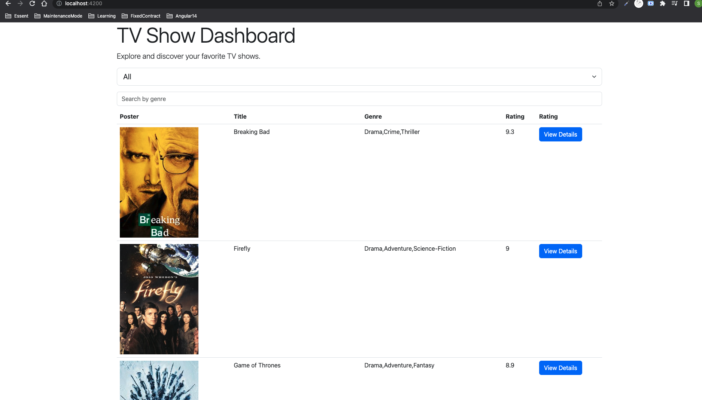
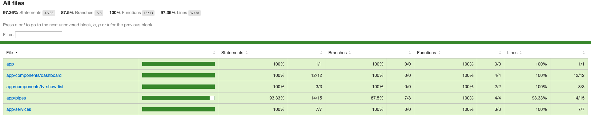

## Steps to run the project:

1. Clone the repository

2. Navigate to the project directory: Use the cd command to enter the project directory

3. Install dependencies: Run the following command to install the project dependencies:
   `npm install`

4. Run the development server: Execute the following command to start the development server:
   `npm start`

5. Once the application is started, visit `http://localhost:4200` to see the application

6. Run unit tests: To run the unit tests and generate the coverage report, use the following command:
   `npm test`

7. Output of the UI
   

8. Output of the test coverage
   
